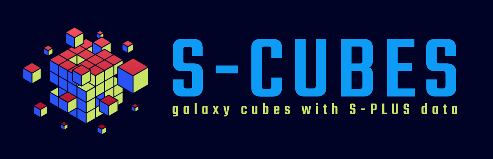

S-Cubes is splusdata package designed to make galaxy cubes (X, Y, Lambda)
with S-PLUS data. 

- **OLD repository:** <https://github.com/splus-collab/s-cubes/>
- **OLD Online Documentation:** <https://splus-collab.github.io/s-cubes/>